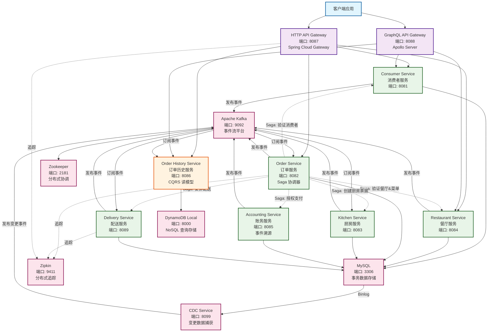

# FTGO 微服务架构详解

## 目录
- [架构概览](#架构概览)
- [微服务关系图](#微服务关系图)
- [服务详细说明](#服务详细说明)
- [核心架构模式](#核心架构模式)
- [服务间通信](#服务间通信)
- [客户端 UI 说明](#客户端-ui-说明)
- [部署架构](#部署架构)

## 架构概览

FTGO (Food To Go) 是一个演示微服务架构模式的示例应用，来自 Chris Richardson 的《微服务架构设计模式》一书。该项目展示了生产级别的分布式系统模式实现。

### 技术栈
- **编程语言**: Java (Spring Boot)
- **消息中间件**: Apache Kafka
- **数据库**: MySQL (事务数据), DynamoDB (查询优化)
- **事件框架**: Eventuate Tram (事务消息, Saga编排)
- **容器化**: Docker, Docker Compose, Kubernetes
- **API 网关**: Spring Cloud Gateway, GraphQL (Apollo Server)
- **监控**: Zipkin (分布式追踪)

## 微服务关系图



## 服务详细说明

### 核心业务服务

#### 1. **Consumer Service (消费者服务)**
- **端口**: 8081
- **职责**: 管理消费者（客户）信息
- **主要功能**:
  - 创建和管理消费者账户
  - 验证消费者订单资格
  - 参与订单创建 Saga

#### 2. **Restaurant Service (餐厅服务)**
- **端口**: 8084
- **职责**: 管理餐厅和菜单
- **主要功能**:
  - 餐厅信息维护
  - 菜单管理（菜品、价格）
  - 验证订单中的餐厅和菜品

#### 3. **Order Service (订单服务)**
- **端口**: 8082
- **职责**: 订单管理和 Saga 协调
- **主要功能**:
  - 创建、修改、取消订单
  - 协调 CreateOrderSaga、CancelOrderSaga、ReviseOrderSaga
  - 维护订单状态机
- **特点**: 作为 Saga 协调器，管理分布式事务

#### 4. **Kitchen Service (厨房服务)**
- **端口**: 8083
- **职责**: 管理厨房操作
- **主要功能**:
  - 创建和管理厨房票据（Kitchen Ticket）
  - 接受或拒绝订单
  - 更新制作状态

#### 5. **Accounting Service (账务服务)**
- **端口**: 8085
- **职责**: 财务和支付管理
- **主要功能**:
  - 支付授权
  - 账户管理
  - 财务审计
- **特点**: 使用事件溯源（Event Sourcing）模式

#### 6. **Delivery Service (配送服务)**
- **端口**: 8089
- **职责**: 配送管理
- **主要功能**:
  - 创建配送任务
  - 分配配送员
  - 跟踪配送状态

### 查询服务

#### 7. **Order History Service (订单历史服务)**
- **端口**: 8086
- **职责**: CQRS 查询视图
- **主要功能**:
  - 提供订单历史查询
  - 按消费者 ID 查询订单
  - 优化的读取性能
- **特点**: 
  - 实现 CQRS 模式
  - 使用 DynamoDB 存储
  - 通过事件同步数据

### API 网关

#### 8. **HTTP API Gateway**
- **端口**: 8087
- **技术**: Spring Cloud Gateway
- **功能**:
  - 路由请求到后端服务
  - 聚合多个服务的响应
  - 统一的 HTTP REST API 入口

#### 9. **GraphQL API Gateway**
- **端口**: 8088
- **技术**: Node.js + Apollo Server
- **功能**:
  - 提供 GraphQL API
  - GraphQL Playground UI
  - 数据聚合和按需查询

## 核心架构模式

### 1. **Saga 模式**
用于管理分布式事务，确保跨服务的数据一致性。

**实现的 Saga:**
- `CreateOrderSaga`: 创建订单流程
- `CancelOrderSaga`: 取消订单流程
- `ReviseOrderSaga`: 修改订单流程

**Saga 步骤示例 (CreateOrderSaga):**
1. 验证消费者 → Consumer Service
2. 创建订单 → Order Service
3. 授权支付 → Accounting Service
4. 确认订单详情 → Kitchen Service
5. 创建配送任务 → Delivery Service

### 2. **Event Sourcing (事件溯源)**
- **实现服务**: Accounting Service
- **优势**: 
  - 完整的审计日志
  - 可以重建任意时间点的状态
  - 支持复杂的业务分析

### 3. **CQRS (命令查询职责分离)**
- **写模型**: 各业务服务的 MySQL 数据库
- **读模型**: Order History Service 的 DynamoDB
- **同步机制**: 通过 Kafka 事件流同步

### 4. **Database per Service**
- 每个服务拥有独立的数据库 schema
- 服务间不共享数据库
- 通过 API 或事件进行数据交换

### 5. **API Gateway 模式**
- 为客户端提供统一入口
- 简化客户端逻辑
- 处理横切关注点（认证、限流等）

## 服务间通信

### 1. **同步通信**
- REST API (HTTP)
- 用于：API Gateway → 后端服务

### 2. **异步通信**
- Apache Kafka (事件/消息)
- 用于：
  - Saga 命令/回复
  - 领域事件发布/订阅
  - CQRS 数据同步

### 3. **通信通道**
```
ftgo.consumer.service       - 消费者服务消息通道
ftgo.restaurant.service     - 餐厅服务消息通道
ftgo.order.service         - 订单服务消息通道
ftgo.kitchen.service       - 厨房服务消息通道
ftgo.accounting.service    - 账务服务消息通道
ftgo.delivery.service      - 配送服务消息通道
```

## 客户端 UI 说明

### 当前 UI 状态

#### ❌ **没有传统的前端应用**
- 项目专注于后端微服务架构演示
- 没有 React、Vue、Angular 等前端框架实现
- 主要通过 API 进行交互

#### ✅ **可用的 UI 界面**

1. **Swagger UI** - API 文档和测试
   - 每个服务都提供 Swagger UI
   - 访问地址: `http://localhost:808X/swagger-ui/index.html`
   - 快速打开所有: `./open-swagger-uis.sh`

2. **GraphQL Playground** - GraphQL 查询界面
   - 地址: `http://localhost:8088/graphql`
   - 交互式 GraphQL 查询和文档

3. **监控界面**
   - Zipkin UI: `http://localhost:9411` - 分布式链路追踪
   - Kafka UI: `http://localhost:9088` - 消息队列监控

### 客户端集成方式

#### 1. **REST API 集成**
```bash
# 通过 API Gateway
curl -X POST http://localhost:8087/orders \
  -H "Content-Type: application/json" \
  -d '{"consumerId": 1, "restaurantId": 1, ...}'

# 直接调用服务
curl http://localhost:8081/consumers/1
```

#### 2. **GraphQL 集成**
```graphql
# GraphQL 查询示例
query {
  consumer(id: "1") {
    name
    orders {
      orderId
      status
      total
    }
  }
}
```

#### 3. **开发自定义 UI**
如需开发前端应用，推荐：
- 使用 API Gateway (8087) 作为统一后端
- 或使用 GraphQL Gateway (8088) 获得更灵活的查询
- 所有 API 都有完整的 Swagger/GraphQL 文档

## 部署架构

### Docker Compose 部署
```bash
# 启动所有服务
./gradlew :composeUp

# 启动基础设施
./gradlew infrastructureComposeUp

# 停止服务
./gradlew :composeDown
```

### Kubernetes 部署
```bash
# 部署到 K8s
./deployment/kubernetes/scripts/kubernetes-deploy-all.sh

# 删除部署
./deployment/kubernetes/scripts/kubernetes-delete-all.sh
```

### 服务启动顺序
1. **基础设施层**: Zookeeper → Kafka, MySQL, DynamoDB
2. **CDC 服务**: 依赖 MySQL 和 Kafka
3. **业务服务**: 可并行启动
4. **查询服务**: Order History Service
5. **API 网关**: 最后启动

### 资源要求
- **内存**: 建议至少 16GB RAM
- **CPU**: 4 核心或以上
- **存储**: 10GB 可用空间

## 开发和测试

### 常用命令
```bash
# 创建测试数据
./create-test-data.sh

# 查看服务日志
docker-compose logs -f [service-name]

# 扫描订单历史
./scan-order-history-view.sh

# 数据库命令行
./mysql-cli.sh
```

### 测试策略
- **单元测试**: 领域逻辑测试
- **集成测试**: 消息处理测试
- **组件测试**: 服务边界测试
- **端到端测试**: 完整工作流测试

## 总结

FTGO 应用展示了一个完整的微服务架构实现，包含了生产环境中常见的架构模式和最佳实践。虽然没有传统的 Web UI，但通过 API Gateway、Swagger UI 和 GraphQL Playground 提供了完善的交互方式，非常适合学习和演示微服务架构模式。